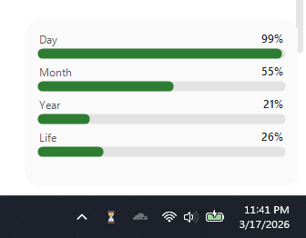
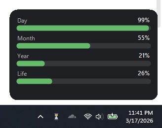
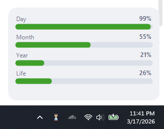
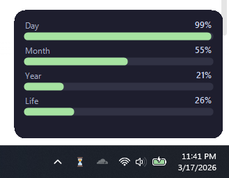

# TrayTempra

A simple Windows tray app that displays time progress, such as of the day, of the month, of the year, and even of your life in a stylized popup window.

## Features

- Shows progress for the current day, month, and year
- Optional life progress (based on birthdate and expected lifespan that you set)
- Themes support (light/dark and catppuccin mocha / latte)
- Auto-start with Windows option
- Runs in the system tray

## Themes

| Plain Light | Plain Dark |
|-------------|------------|
|  |  |

| Catppuccin Latte | Catppuccin Mocha |
|------------------|------------------|
|  |  |

## Usage

1. [Download from releases](https://github.com/WendellTech/TrayTempra/releases/latest)
2. Extract and Launch the application, it will appear in the system tray (default bottom right of the screen)
3. Left-click the tray icon to open the progress popup
4. Right-click for settings and exit options

## Requirements for Building App

- Windows
- .NET 10.0 Runtime

## Building

```bash
dotnet build
```

The executable will be in `bin/Debug/net10.0-windows/`.
